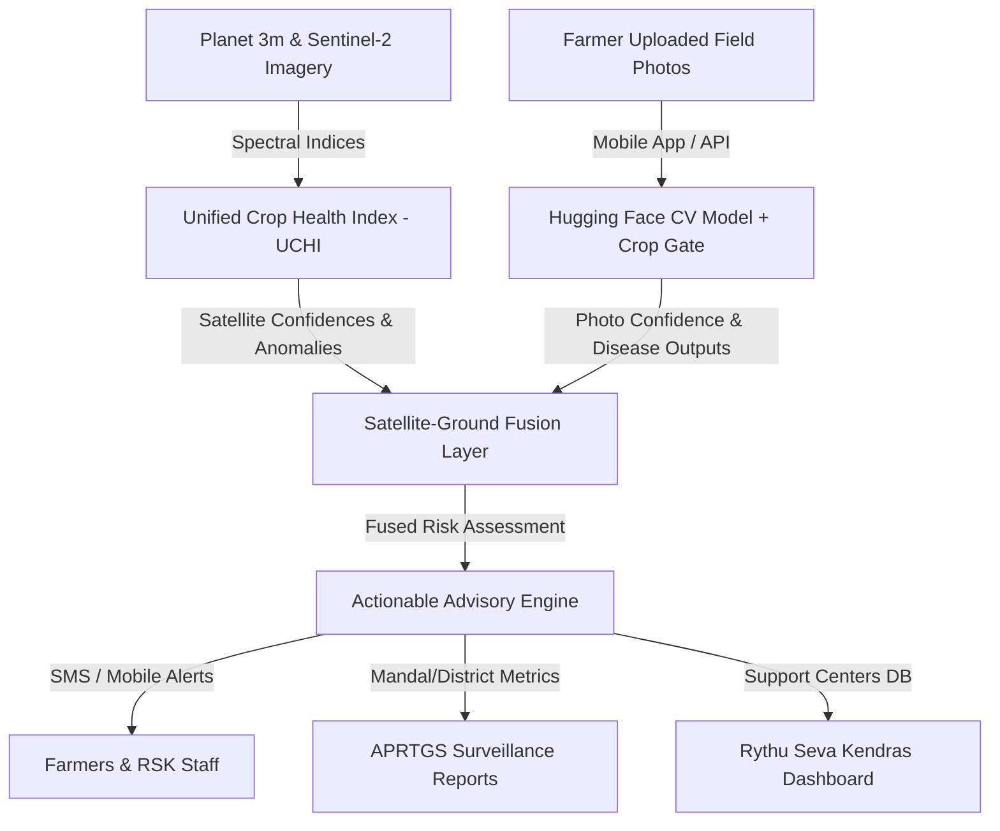

# Technical Analysis: AI-based Crop Health Surveillance & Automated Alerts System (CHSS)
**Theme**: AI for Proactive Crop Health Monitoring and Pest Disease Management  
**Department**: Agriculture Department, Government of Andhra Pradesh  

---

## 1. Executive Summary & Challenge Alignment
In Andhra Pradesh, agricultural yield losses of 15% to 30% in key crops (paddy, cotton, chilli, red gram, maize) are driven by delayed detection of pest, disease, and abiotic stressors. The **Crop Health Surveillance System (CHSS)** transforms this reactive paradigm into a proactive, data-driven framework. 

By integrating high-resolution satellite imagery (Planet 3m weekly, Sentinel-2 Red Edge bands) with edge-enabled smartphone photo-analytics, CHSS establishes a scalable, parcel-level monitoring loop. This analysis outlines the architectural blueprint, mathematical indices, AI classifier gates, data-fusion parameters, and government portal integrations (Rythu Seva Kendras - RSKs, APRTGS) required to pilot this system across 5–7 mandals during the Kharif season.

---

## 2. Technical Architecture & Component Analysis

### A. Satellite-Based Crop Health Monitoring
Instead of relying on single spectral bands or isolated indices, CHSS implements a **Unified Crop Health Index (UCHI)** that aggregates indices to minimize atmospheric interference and maximize chlorophyll and structure sensitivity:

$$\text{UCHI} = 0.35 \times \text{NDVI} + 0.25 \times \text{EVI} + 0.25 \times \text{NDRE} + 0.15 \times \text{SAVI}$$

*   **NDVI (Normalized Difference Vegetation Index)**: Measures overall vegetation greenness and canopy cover.
*   **EVI (Enhanced Vegetation Index)**: Reduces soil background noise and atmospheric constraints, crucial for dense crop stages.
*   **NDRE (Normalized Difference Red Edge Index)**: Utilizes Sentinel-2's Red Edge bands to penetrate deeper into the canopy, providing superior early detection of chlorophyll degradation.
*   **SAVI (Soil-Adjusted Vegetation Index)**: Adjusts for soil brightness in early crop vegetative stages (low leaf area index).

**Monitoring Cycle**: Satellite data processing runs on a **fortnightly schedule** to track parcel-level health index trends over time.

---

### B. Automated Anomaly Detection
CHSS separates stress signatures into abiotic and biotic classifications by tracking deviations from historical and seasonal baselines:
*   **Abiotic Stress Proxy**: Calculated using vegetation stress trends cross-referenced with local soil moisture indices (EVI/NDVI divergence) and IMD weather data (rainfall/temperature anomalies).
    *   *Drought/Moisture Deficit*: Evidenced by a dropping SAVI and dropping soil moisture score, indicating immediate irrigation needs.
    *   *Nutrient Deficiency*: Evidenced by declining chlorophyll absorption (low NDRE) without a corresponding decrease in canopy coverage (moderate SAVI).
*   **Biotic Stress Proxy**: Derived from localized anomaly hotspots that deviate from surrounding fields. A sudden localized drop in NDVI/EVI indicates pest infestations or disease spread.

---

### C. Smartphone Photo Analytics
Farmers and field agents capture crop anomalies using a mobile app. The ground validation pipeline utilizes two primary checks:
1.  **Crop Gating (CV & Filename Matching)**: Resolves user input errors. The app reads file metadata (suggested crop class) and passes it to an image-classification crop gate. If the model-predicted crop mismatch exceeds threshold parameters, it alerts the operator.
2.  **Disease Classification with Confidence Scores**: The Hugging Face image classification model detects disease categories (e.g., *Paddy Blast*, *Cotton Bollworm*, *Maize Downy Mildew*) and provides explicit class confidence percentages.
    *   *Low Confidence (< 50%)*: Defers classification to RSK agricultural officers for manual review.
    *   *Medium-High Confidence (≥ 50%)*: Triggers automatic diagnostic pathways.

---

### D. Satellite-Ground Data Integration (Data Fusion)
Data fusion acts as the verification engine to reduce false positives in automated satellite alerts:
*   **Fused Confidence Calculation**: Combining satellite-derived spectral anomaly scores with ground-level photo analytics:

$$\text{Unified Confidence} = w_1 \times \text{Satellite Confidence} + w_2 \times \text{Photo Confidence}$$

*   **Conflict Resolution**:
    *   *Scenario A (Satellite Stress + Photo Disease)*: Fuses into a **High-Risk Biotic Alert**. High confidence, triggering immediate local agronomic intervention advisories.
    *   *Scenario B (Satellite Stress + Photo Healthy)*: Suggests a potential abiotic stressor (e.g., nitrogen deficiency, moisture deficit) rather than a pest. Fuses into an **Abiotic Advisory**.
    *   *Scenario C (Satellite Healthy + Photo Disease)*: Represents an early-stage localized infection. Fuses into a **Medium-Risk Pre-Emptive Alert**, instructing neighboring fields to scout.

---

## E. Farmer Alert & Advisory System
Once a stress or disease is verified, the system queries the local advisory guidelines for the crop and sends targeted alerts:
*   **Actionable Content**: Farmers receive the detected stress type, severity classification (Low, Medium, High, Critical), confidence score, and clear agronomic advisories (chemical dosages, organic remedies, irrigation adjustments).
*   **Dissemination Channels**: Delivered via SMS, mobile app notifications, or interactive voice response (IVR) for offline compatibility.

---

## F. Department Dashboards & Reports
Surveillance data is aggregated hierarchically:
*   **Rythu Seva Kendras (RSK) Integration**: Individual parcel alerts are routed to the corresponding RSK. Local officers receive notifications of active hotspots within their jurisdiction for targeted crop scouting.
*   **APRTGS (Andhra Pradesh Real Time Governance Society)**: Mandal-level and district-level surveillance reports summarize:
    *   Total parcels monitored and active disease hotspots.
    *   Average UCHI per crop type.
    *   Predicted yield impact percentages using historical crop-yield datasets.
    *   Geospatial risk heatmaps identifying high-risk mandals.

---

## G. Offline & Low-Connectivity Support
To support farmers in remote zones with low connectivity:
1.  **Deferred Data Sync**: The smartphone application stores geo-tagged, time-stamped images locally when offline. Data syncs automatically once network reception is restored.
2.  **SMS/IVR Advisories**: In zero-data-network areas, notifications are fallbacked to standard GSM SMS channels and automated IVR voice queries, ensuring even non-smartphone users receive timely alerts.

---

## 3. Focus Crops Implementation Strategy

| Crop | Target Biotic Stresses (Pests/Diseases) | Target Abiotic Stresses | Recommended Agronomic Interventions (Sample) |
| :--- | :--- | :--- | :--- |
| **Paddy** | Blast, Brown Spot, Stem Borer, Bacterial Leaf Blight | Submergence, Salinity, Nitrogen deficiency | Apply Tricyclazole for Blast; optimize nitrogen top-dressing; manage standing water level. |
| **Cotton** | Pink Bollworm, Leaf Blight, sucking pests (Thrips) | Moisture stress, Magnesium deficiency | Deploy pheromone traps for PBW; apply foliar spray of magnesium sulphate (1%). |
| **Red Gram**| Wilt, Pod Borer, Sterility Mosaic | Waterlogging, Drought stress | Improve field drainage; apply Chlorpyriphos for Pod Borer; practice crop rotation. |
| **Maize** | Fall Armyworm, Downy Mildew, Turcicum Leaf Blight | Zinc deficiency, moisture stress | Apply Emamectin Benzoate for FAW; spray Zinc Sulphate (0.5%) for deficiency. |
| **Chilli** | Thrips, Dieback, Powdery Mildew, Gemini Virus | Excess soil moisture, calcium deficiency | Apply Fipronil for Thrips; spray Mancozeb for Dieback; improve aeration in bed layout. |

---

## 4. Proof of Concept (PoC) Scope & Evaluation Metrics
*   **Geographic Scope**: 5–7 selected mandals within a high-agriculture district during the Kharif season.
*   **Target Accuracy**: Achieve **≥ 75% accuracy** in combined stress, pest, and disease detection compared with randomized ground surveys.
*   **Key Performance Indicators (KPIs)**:
    *   *Sensitivity*: $\geq 70\%$ detection sensitivity relative to field-reported pest incidents.
    *   *False Positive Rate*: $\leq 20\%$ false alarms, ensuring high trust among farmers and department officers.
    *   *Mean Time to Alert (MTTA)*: Trigger alerts within **48 hours** of satellite image processing or photo upload.
    *   *Scalability*: Average parcel query response times under 200ms using spatial indexing (PostGIS).

---

## 5. Modern Web Application Implementation Alignment
The existing repository code in `agrishield-ap` aligns with these goals:
1.  **FastAPI Backend (`backend/fastapi/app`)**:
    *   [main.py](file:///c:/Users/windows-11/Desktop/agrishield-ap/backend/fastapi/app/main.py): Implements UCHI computations, crop-gated disease analytics using Hugging Face transformers, and open-meteo weather correlations.
    *   [schemas.py](file:///c:/Users/windows-11/Desktop/agrishield-ap/backend/fastapi/app/schemas.py): Defers data structures for spectral layers (`SpectralPointOut`, `LayerAnalyticsOut`), fusion payloads (`FusionFuseInput`, `FusionResponseOut`), and surveillance dashboards (`SurveillanceDataOut`).
2.  **Vite + React Frontend (`src/routes`)**:
    *   [satellite.tsx](file:///c:/Users/windows-11/Desktop/agrishield-ap/src/routes/satellite.tsx): Renders geographic parcel-level maps, allowing fortnightly health index tracking.
    *   [surveillance.tsx](file:///c:/Users/windows-11/Desktop/agrishield-ap/src/routes/surveillance.tsx): Builds mandal-level dashboards showcasing crop distribution and disease trends.
    *   [farmers/scan.tsx](file:///c:/Users/windows-11/Desktop/agrishield-ap/src/routes/farmers/scan.tsx): Direct portal for field staff to upload geo-tagged images for computer vision diagnosis.
